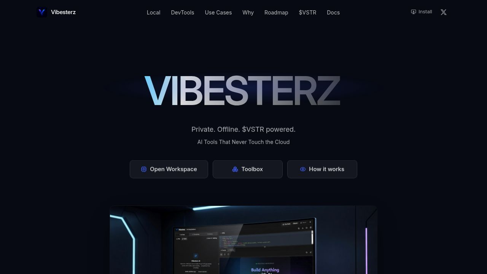
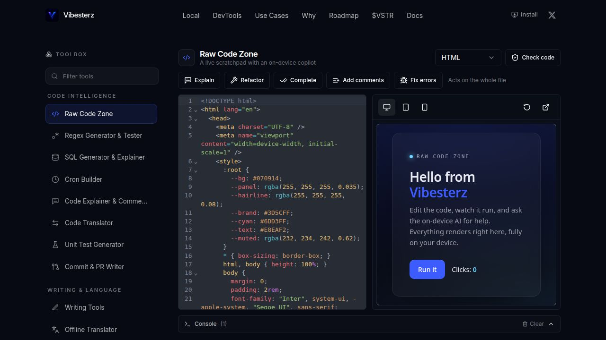
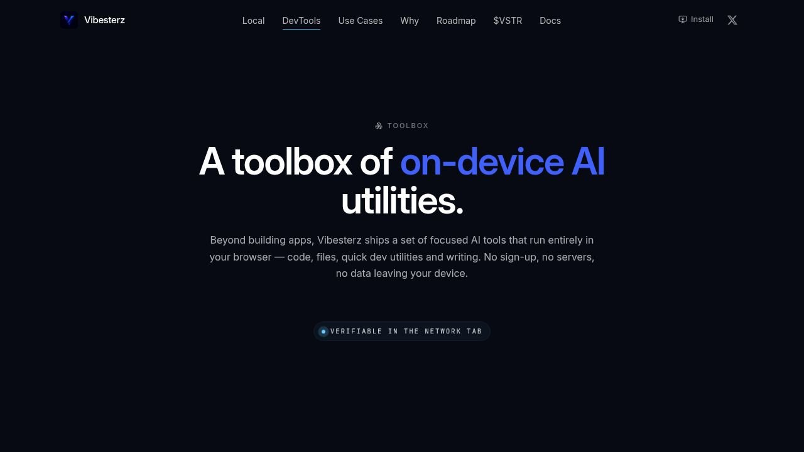

  

<h1 align="center">Vibesterz</h1>

<strong>Private. Offline. AI tools that never touch the cloud.</strong>

  
  
  
  
  

  <a href="https://vibesterz.com/"><strong>Open the live app</strong></a>
  &nbsp;&middot;&nbsp;
  <a href="https://x.com/Vibesterz_">Follow on X</a>

  

---

## What Vibesterz is

Vibesterz is a browser based AI workspace that builds working web apps and runs a
deep catalog of practical AI tools. The model runs on your own device through
WebGPU. Your prompts, your code, your files and everything the AI produces stay
on your machine.

There is no sign up. You open the workspace and start building. Once the app and
a model are loaded, the core experience keeps working with the network turned
off, because Vibesterz is an offline first progressive web app.

This repository is the public home for the project: what it does, how it is built
at a high level, how it protects your data, and where to follow along. The product
itself lives at [vibesterz.com](https://vibesterz.com/).

## Why it matters

Most AI tools send your prompts and files to a server you do not control. Vibesterz
takes the opposite position. The intelligence comes to your hardware instead of
your data going to a data center.

- **Your data stays with you.** Inference happens inside your browser tab on your
  own GPU. Your content is not uploaded to run the model.
- **It works without a connection.** After the first load, the workspace and tools
  keep running offline.
- **No account, no profile.** There is nothing to sign in to, so there is no
  account to breach and no usage history sitting on a server.
- **No usage meter.** There are no credits to count and no daily cap on how much
  you can build.

## See it work

| Build apps with an on-device copilot | A toolbox of focused AI utilities |
| --- | --- |
|  |  |

## The toolbox

Beyond building apps, Vibesterz ships 59 focused tools across ten areas. They run
on your device and process your content locally, not on a server. This is the full
set, grouped by what you are trying to do. It is deliberately broad. The goal is a
tool you actually reach for, not a thin demo.

### Code Intelligence
Generate, run and reason about code on your device.

- **Raw Code Zone** &middot; A live code playground that generates, runs and refines snippets with an on-device copilot.
- **Regex Generator and Tester** &middot; Describe a match in plain English, get a pattern, and test it live.
- **SQL Generator and Explainer** &middot; Turn a schema and a question into a query, or explain and optimize SQL you paste.
- **Cron Builder** &middot; Describe a schedule in plain English and get a cron expression with next run previews.
- **Code Explainer and Commenter** &middot; Get a plain English walkthrough, or add idiomatic comments and docstrings inline.
- **Code Translator** &middot; Convert a snippet between languages such as Python, JavaScript and Go.
- **Unit Test Generator** &middot; Get a test suite covering the happy path, edge cases and bad input.
- **Commit and PR Writer** &middot; Paste a git diff and get a clean commit message and a ready to use PR description.

### Writing and Language
Draft, rewrite and polish text without it leaving the browser.

- **Writing Tools** &middot; Draft, rewrite, summarise and proofread text.
- **Offline Translator** &middot; Translate across 100 plus languages on your device.
- **Grammar and Style** &middot; Fix grammar and polish clarity, with a clear list of what changed.
- **Tone and Readability** &middot; Rewrite to a target tone and reading level with a live readability score.
- **Email Assistant** &middot; Draft and reply to email, and adjust tone and length.
- **Resume and Cover Letter** &middot; Tailor a resume to a job, write a cover letter, run an ATS check and export to PDF.
- **Flashcards and Quiz** &middot; Turn notes into study flashcards or a quiz, with export.
- **Quick Generators** &middot; Names, usernames, slugs and lorem ipsum with no waiting.

### Data and Spreadsheets
Explore and question your own structured data locally.

- **Chat With Your Data** &middot; Ask plain English questions about a spreadsheet, answered from your real data.
- **Data Cleaner** &middot; Deduplicate, trim, normalize casing and dates, and repair garbled text.
- **Smart Column Categorizer** &middot; Tag every row into clean categories with an on-device model.
- **Format Converter** &middot; Convert between CSV, JSON, Excel, YAML and XML.
- **Formula Generator** &middot; Describe what you need and get an Excel, Sheets or Airtable formula.
- **Chart and Dashboard Builder** &middot; Turn a spreadsheet into charts and export them as PNG or SVG.
- **Data Anonymizer** &middot; Detect personal data and mask, hash or replace it with realistic synthetic values.
- **Sentiment and Theme Analyzer** &middot; Score sentiment and surface recurring themes across text rows.

### Documents and PDF
Read, convert and extract from documents on your device.

- **PDF Toolkit** &middot; Merge, split, reorder, rotate, delete pages and compress PDFs.
- **PDF Converter** &middot; Convert PDF to text, Markdown or Word, and turn those back into a clean PDF.
- **Form Filler and Sign** &middot; Fill PDF form fields, add a signature, flatten and download.
- **Document Scanner** &middot; Scan with your camera or photos, clean up the page, and save a searchable PDF.
- **Document Assistant** &middot; Summarize long documents, explain contracts in plain English with risk flags, and ask questions.
- **Receipts to Spreadsheet** &middot; Turn a batch of receipts or invoices into an editable CSV.

### Vision and Image
Understand images, screenshots and scans entirely offline.

- **Vision and Document Intelligence** &middot; Extract text, turn photos and tables into spreadsheets, and describe images.
- **Background Remover** &middot; Cut out the subject and export a clean transparent PNG.
- **Image Upscaler** &middot; Sharpen and enlarge images with an on-device super resolution model.
- **Object Detection and Auto Tagging** &middot; Find and label objects, draw boxes, and tag whole batches.
- **Image Classification and Smart Sort** &middot; Label image content and group a folder by what it contains.
- **Depth and Portrait** &middot; Estimate a depth map and apply a depth aware background blur.
- **Smart Image Compressor** &middot; Shrink images to WebP, AVIF or JPEG with a live size comparison.
- **Color Palette Extractor** &middot; Pull dominant colors from any image and turn them into design tokens.
- **QR and Barcode Studio** &middot; Generate QR codes and barcodes, or scan them from an image.

### Audio and Voice
Transcribe, dictate and speak in the browser.

- **Audio and Voice** &middot; Transcribe speech to text, dictate, and turn text into spoken audio, all on your device.

### Image Generation
Create images on-device, with no server in the loop.

- **Image Generation** &middot; Turn a text prompt into an image on your device with WebGPU. *(Coming soon.)*

### Knowledge and Search
Ask questions of your own files and notes, privately.

- **Chat With Your Files** &middot; Ask questions about your own documents with private offline retrieval.
- **Semantic Folder Search** &middot; Search documents by meaning rather than keywords.
- **Duplicate Finder** &middot; Spot near identical passages across files by similarity.
- **Auto Tagger and Clusterer** &middot; Group notes, bookmarks and snippets into readable topics.
- **Personal Knowledge Base** &middot; Ask anything across many documents, with citations.

### Dev Utilities
Small, fast developer helpers.

- **Dev Quick Tools** &middot; A suite of small developer utilities: formatters, converters and generators.
- **Mock Data and API Studio** &middot; Generate realistic fake datasets and a live local mock API to build against.
- **JSON and Schema Tools** &middot; Format, validate, diff and convert JSON, plus a JSONPath tester.
- **API Request Playground** &middot; A local REST client with request history kept in your browser.
- **Diff and Merge Viewer** &middot; Compare text, code or JSON side by side or inline.
- **Color and CSS Studio** &middot; Convert colors, check WCAG contrast and build gradients and shadows.
- **Secret Scanner** &middot; Detect leaked API keys, tokens and credentials in pasted code or files.

### Privacy and Security
Strip, mask and protect sensitive data before you share it.

- **Private Redactor** &middot; Strip names, emails, secrets and other sensitive data out of text, docx and pdf.
- **Metadata Stripper** &middot; Reveal hidden EXIF, GPS and camera data, then download a clean copy with it removed.
- **Password Studio** &middot; Generate strong passwords and passphrases, and audit how tough an existing one is.
- **Hash and Integrity Checker** &middot; Fingerprint a file or text with SHA and MD5, and verify a checksum.
- **Encryption Vault** &middot; Lock any file with a passphrase using AES 256, and unlock it again.
- **Hidden Message in Image** &middot; Embed a secret note inside an image, or reveal one already hidden there.

## How it works

A short, high level picture lives in [docs/architecture.md](docs/architecture.md).
In one paragraph: the workspace loads a language model into your browser and runs
it on your GPU through WebGPU. When you ask for an app, it plans the build, writes
the code, reviews its own output and polishes the result before showing you a live
preview. Everything renders in the same tab. Your work is saved locally so it
survives a refresh and stays available offline.

## Privacy and security

Vibesterz is built so that the AI comes to your data, not the other way around.
The full detail is in [docs/privacy.md](docs/privacy.md). The short version:

- **Inference is on-device.** The model runs in your browser tab on your GPU. Your
  prompts, code and files are not uploaded to generate results.
- **No accounts.** There is no sign in, no password and no server side profile.
- **Local storage.** Your projects and history are stored in your browser, not in a
  central database.
- **Honest about the network.** A connection is used to load the app and download a
  model the first time, and only for a few clearly optional things after that: an
  optional proxy when an app you build calls an external API, and the publish
  feature if you choose to share an app. Generating with the AI does not send your
  content to a server.

You can confirm the on-device behavior yourself. Open your browser developer tools,
go to the Network tab, load a model once, then generate. The generation itself
makes no calls that carry your prompt or files to a server.

## Never run out of credits

Vibesterz has no usage meter. There are no per generation credits to count and no
daily cap on how much you can build. Because the model runs on your own hardware,
generating costs nothing per run. That is what "never run out of credits" means
here: no metering of your work, not a promise that everything is free of charge
under every condition.

To be exact about access: the browser workspace is free to use, with no account,
until June 10, 2026. After that date, continued web access requires holding $350 of
the project token, $VSTR, in your wallet. A permanent offline install is a one time
$VSTR burn. The full mechanics, including a live countdown, are on the live site at
[vibesterz.com](https://vibesterz.com/).

## Status

The product is live and updated regularly. The current direction and what is next
are published on the roadmap inside the app. Image Generation is marked as coming
soon in the toolbox.

## Stay in touch

- Live app: [vibesterz.com](https://vibesterz.com/)
- X: [@Vibesterz_](https://x.com/Vibesterz_)
- Questions and ideas: open a [Discussion](../../discussions)
- Something not working: open an [Issue](../../issues)

## License

This repository and its contents are proprietary. All rights reserved. Vibesterz
is not open source, and the application source code is not included here. See
[LICENSE](LICENSE) for the terms. For security reports, see
[SECURITY.md](SECURITY.md).
